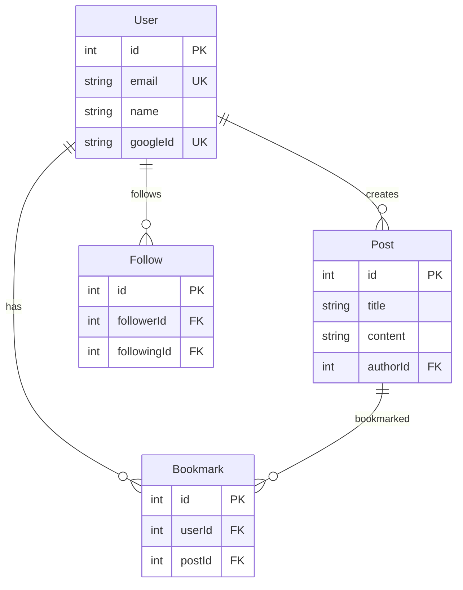
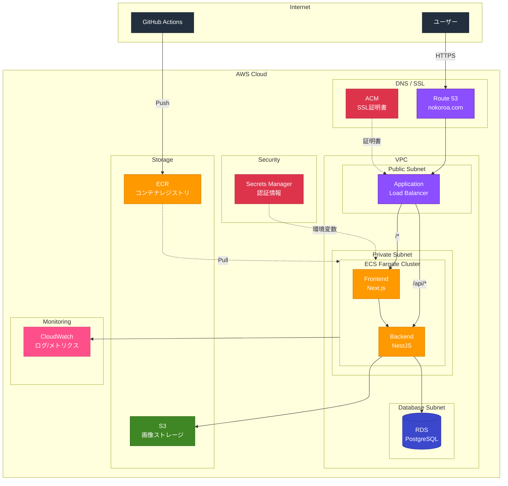

# Nokoroa

旅の思い出を共有するソーシャルプラットフォーム

**URL**: https://nokoroa.com


## 概要

Nokoroaは、旅行の思い出を写真と共に共有できるWebアプリケーションです。ユーザーは旅先での体験を投稿し、地図上で視覚的に探索できます。

### 主な機能

- 写真・位置情報・タグ付きの旅行体験投稿
- Google Mapsを活用した地図検索
- ブックマーク機能
- フォロー/フォロワー機能
- ユーザープロフィール管理
- Google OAuth認証

## 開発背景

旅行が好きで、旅先での思い出を共有することに特化したサービスがあれば便利だと感じたのがきっかけです。

Instagramなどの既存SNSでは、投稿形式が限定されていたり、旅行以外の様々な投稿が混在してしまい、旅行体験だけを振り返ったり探したりするのが難しいと感じていました。また、旅行に特化した既存アプリを探してみましたが、満足できるものが見つかりませんでした。

そこで、旅行の思い出共有に特化し、地図から投稿を探せるなど旅行体験に最適化されたプラットフォームを自分で作ることにしました。

## 使用技術一覧

**バックエンド**: Node.js 23 / NestJS 11 / TypeScript 5 / Prisma 6 / PostgreSQL

コード解析 / フォーマッター: ESLint / Prettier

テストフレームワーク: Jest / SuperTest

**フロントエンド**: TypeScript 5 / React 19 / Next.js 15 (App Router)

コード解析 / フォーマッター: ESLint / Prettier

CSSフレームワーク: Material-UI v7

主要パッケージ: SWR / React Hook Form / Zod / react-hot-toast / date-fns

**インフラ**: AWS (Route53 / ACM / ALB / VPC / ECR / ECS Fargate / RDS PostgreSQL / S3 / CloudWatch)

CI / CD: GitHub Actions

IaC: Terraform

環境構築: Docker / Docker Compose

**認証**: JWT / Google OAuth 2.0 / Google Maps JavaScript API

## テストユーザー

以下のアカウントでログインできます。

| メールアドレス | パスワード |
|---------------|-----------|
| michael@example.com | password123 |
| james@example.com | password123 |
| pierre@example.com | password123 |
| david@example.com | password123 |
| alex@example.com | password123 |

## ER図



## ディレクトリ構成

```
nokoroa/
├── nokoroa-backend/
│   ├── src/
│   │   ├── auth/                # 認証モジュール (JWT, Google OAuth)
│   │   │   ├── strategies/      # Passport認証戦略
│   │   │   ├── auth.controller.ts
│   │   │   ├── auth.service.ts
│   │   │   └── jwt-auth.guard.ts
│   │   ├── users/               # ユーザー管理モジュール
│   │   │   ├── dto/             # リクエスト/レスポンスDTO
│   │   │   ├── users.controller.ts
│   │   │   └── users.service.ts
│   │   ├── posts/               # 投稿モジュール
│   │   │   ├── dto/             # 投稿関連DTO
│   │   │   ├── posts.controller.ts
│   │   │   └── posts.service.ts
│   │   ├── favorites/           # ブックマークモジュール
│   │   ├── follows/             # フォローモジュール
│   │   ├── prisma/              # Prismaサービス
│   │   └── main.ts              # アプリケーションエントリーポイント
│   ├── prisma/
│   │   ├── schema.prisma        # データベーススキーマ
│   │   ├── migrations/          # マイグレーションファイル
│   │   └── seed.ts              # シードデータ
│   ├── test/                    # E2Eテスト
│   ├── Dockerfile
│   └── docker-compose.yml
│
├── nokoroa-frontend/
│   ├── src/
│   │   ├── app/                 # Next.js App Router
│   │   │   ├── posts/           # 投稿ページ
│   │   │   ├── users/           # ユーザーページ
│   │   │   ├── profile/         # プロフィールページ
│   │   │   ├── search/          # 検索ページ
│   │   │   ├── bookmarks/       # ブックマークページ
│   │   │   ├── map/             # 地図ページ
│   │   │   ├── auth/            # 認証コールバック
│   │   │   └── @dialog/         # モーダルダイアログ
│   │   ├── components/          # 共通コンポーネント
│   │   │   ├── post/            # 投稿関連
│   │   │   ├── auth/            # 認証関連
│   │   │   ├── map/             # 地図関連
│   │   │   ├── search/          # 検索関連
│   │   │   └── common/          # 共通UI
│   │   ├── hooks/               # カスタムフック
│   │   ├── providers/           # Contextプロバイダー
│   │   ├── lib/                 # APIクライアント
│   │   ├── types/               # 型定義
│   │   └── utils/               # ユーティリティ
│   ├── public/                  # 静的ファイル
│   └── Dockerfile
│
└── terraform/                   # インフラ構成 (AWS)
    ├── main.tf
    ├── variables.tf
    └── outputs.tf
```

## インフラ構成図


