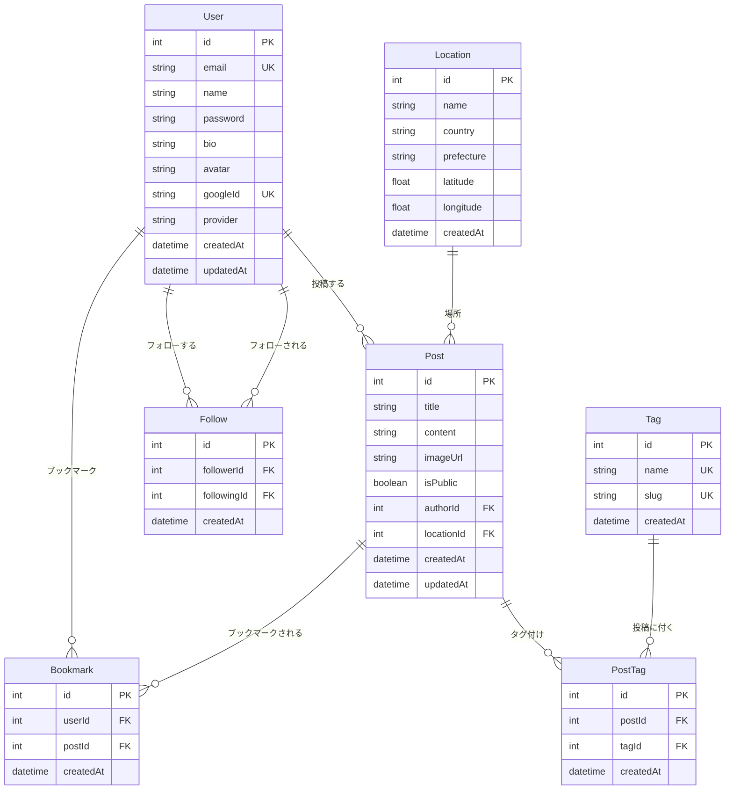

# データベース設計書

## 1. 概要

- DBMS: PostgreSQL
- ORM: Prisma
- 文字コード: UTF-8

---

## 2. ER図

---

## 3. テーブル定義

### 3.1 User (ユーザー)

| カラム名 | 型 | NULL | デフォルト | 説明 |
|---------|-----|------|-----------|------|
| id | SERIAL | NO | AUTO | 主キー |
| email | VARCHAR(255) | NO | - | メールアドレス (UNIQUE) |
| name | VARCHAR(100) | NO | - | 表示名 |
| password | VARCHAR(255) | YES | NULL | ハッシュ化パスワード |
| bio | TEXT | YES | NULL | 自己紹介 |
| avatar | VARCHAR(500) | YES | NULL | アバター画像URL |
| googleId | VARCHAR(255) | YES | NULL | Google ID (UNIQUE) |
| provider | VARCHAR(50) | YES | 'local' | 認証プロバイダー |
| createdAt | TIMESTAMP | NO | NOW() | 作成日時 |
| updatedAt | TIMESTAMP | NO | NOW() | 更新日時 |

**インデックス**
- `email` (UNIQUE)
- `googleId` (UNIQUE)

---

### 3.2 Post (投稿)

| カラム名 | 型 | NULL | デフォルト | 説明 |
|---------|-----|------|-----------|------|
| id | SERIAL | NO | AUTO | 主キー |
| title | VARCHAR(200) | NO | - | タイトル |
| content | TEXT | NO | - | 本文 |
| imageUrl | VARCHAR(500) | YES | NULL | 画像URL |
| isPublic | BOOLEAN | NO | true | 公開フラグ |
| authorId | INT | NO | - | 投稿者ID (FK: User.id) |
| locationId | INT | YES | NULL | 位置情報ID (FK: Location.id) |
| createdAt | TIMESTAMP | NO | NOW() | 作成日時 |
| updatedAt | TIMESTAMP | NO | NOW() | 更新日時 |

**インデックス**
- `authorId`
- `locationId`
- `createdAt`
- `isPublic`

**外部キー**
- `authorId` → `User.id` (CASCADE DELETE)
- `locationId` → `Location.id` (SET NULL)

---

### 3.3 Tag (タグ)

| カラム名 | 型 | NULL | デフォルト | 説明 |
|---------|-----|------|-----------|------|
| id | SERIAL | NO | AUTO | 主キー |
| name | VARCHAR(50) | NO | - | タグ名 (UNIQUE) |
| slug | VARCHAR(50) | NO | - | スラッグ (UNIQUE) |
| createdAt | TIMESTAMP | NO | NOW() | 作成日時 |

**インデックス**
- `name` (UNIQUE)
- `slug` (UNIQUE)

---

### 3.4 PostTag (投稿タグ中間テーブル)

| カラム名 | 型 | NULL | デフォルト | 説明 |
|---------|-----|------|-----------|------|
| id | SERIAL | NO | AUTO | 主キー |
| postId | INT | NO | - | 投稿ID (FK: Post.id) |
| tagId | INT | NO | - | タグID (FK: Tag.id) |
| createdAt | TIMESTAMP | NO | NOW() | 作成日時 |

**制約**
- `(postId, tagId)` UNIQUE

**外部キー**
- `postId` → `Post.id` (CASCADE DELETE)
- `tagId` → `Tag.id` (CASCADE DELETE)

---

### 3.5 Location (位置情報)

| カラム名 | 型 | NULL | デフォルト | 説明 |
|---------|-----|------|-----------|------|
| id | SERIAL | NO | AUTO | 主キー |
| name | VARCHAR(200) | NO | - | 場所名 |
| country | VARCHAR(100) | YES | NULL | 国 |
| prefecture | VARCHAR(100) | YES | NULL | 都道府県 |
| latitude | FLOAT | NO | - | 緯度 |
| longitude | FLOAT | NO | - | 経度 |
| createdAt | TIMESTAMP | NO | NOW() | 作成日時 |

**インデックス**
- `(latitude, longitude)`

---

### 3.6 Bookmark (ブックマーク)

| カラム名 | 型 | NULL | デフォルト | 説明 |
|---------|-----|------|-----------|------|
| id | SERIAL | NO | AUTO | 主キー |
| userId | INT | NO | - | ユーザーID (FK: User.id) |
| postId | INT | NO | - | 投稿ID (FK: Post.id) |
| createdAt | TIMESTAMP | NO | NOW() | 作成日時 |

**制約**
- `(userId, postId)` UNIQUE

**外部キー**
- `userId` → `User.id` (CASCADE DELETE)
- `postId` → `Post.id` (CASCADE DELETE)

---

### 3.7 Follow (フォロー)

| カラム名 | 型 | NULL | デフォルト | 説明 |
|---------|-----|------|-----------|------|
| id | SERIAL | NO | AUTO | 主キー |
| followerId | INT | NO | - | フォローする側ID (FK: User.id) |
| followingId | INT | NO | - | フォローされる側ID (FK: User.id) |
| createdAt | TIMESTAMP | NO | NOW() | 作成日時 |

**制約**
- `(followerId, followingId)` UNIQUE
- `followerId != followingId` (自分自身をフォロー不可)

**外部キー**
- `followerId` → `User.id` (CASCADE DELETE)
- `followingId` → `User.id` (CASCADE DELETE)

---

## 4. マイグレーション履歴

| バージョン | 日付 | 内容 |
|-----------|------|------|
| 001 | 2025-XX-XX | 初期スキーマ作成 |
| 002 | 2025-XX-XX | Location テーブル追加 |
| 003 | 2025-XX-XX | Follow テーブル追加 |
| 004 | 2025-XX-XX | Bookmark テーブル追加 |
