# ユースケース図・ユースケース記述

## 1. ユースケース図

```mermaid
graph TB
    subgraph Actors
        Guest[ゲスト]
        User[ログインユーザー]
    end

    subgraph 認証
        UC1[ユーザー登録]
        UC2[ログイン]
        UC3[Google認証]
        UC4[ログアウト]
    end

    subgraph 投稿
        UC5[投稿一覧を見る]
        UC6[投稿詳細を見る]
        UC7[投稿を作成する]
        UC8[投稿を編集する]
        UC9[投稿を削除する]
        UC10[画像をアップロードする]
    end

    subgraph 検索
        UC11[キーワードで検索する]
        UC12[タグで検索する]
        UC13[地図から検索する]
    end

    subgraph ソーシャル
        UC14[ユーザーをフォローする]
        UC15[フォローを解除する]
        UC16[投稿をブックマークする]
        UC17[ブックマークを解除する]
        UC18[ブックマーク一覧を見る]
    end

    subgraph プロフィール
        UC19[プロフィールを見る]
        UC20[プロフィールを編集する]
        UC21[アバターを変更する]
    end

    Guest --> UC1
    Guest --> UC2
    Guest --> UC3
    Guest --> UC5
    Guest --> UC6
    Guest --> UC11
    Guest --> UC12
    Guest --> UC13
    Guest --> UC19

    User --> UC4
    User --> UC5
    User --> UC6
    User --> UC7
    User --> UC8
    User --> UC9
    User --> UC10
    User --> UC11
    User --> UC12
    User --> UC13
    User --> UC14
    User --> UC15
    User --> UC16
    User --> UC17
    User --> UC18
    User --> UC19
    User --> UC20
    User --> UC21
```

---

## 2. ユースケース記述

### UC-001: ユーザー登録

| 項目 | 内容 |
|------|------|
| アクター | ゲスト |
| 事前条件 | 未登録のメールアドレスを持っている |
| 事後条件 | ユーザーアカウントが作成され、ログイン状態になる |

**基本フロー**:
1. ゲストが新規登録画面にアクセスする
2. 名前、メールアドレス、パスワードを入力する
3. 登録ボタンをクリックする
4. システムが入力値を検証する
5. システムがユーザーアカウントを作成する
6. システムがJWTトークンを発行する
7. トップページにリダイレクトする

**代替フロー**:
- 4a. 入力値が不正な場合、エラーメッセージを表示する
- 5a. メールアドレスが既に登録されている場合、エラーメッセージを表示する

---

### UC-002: ログイン

| 項目 | 内容 |
|------|------|
| アクター | ゲスト |
| 事前条件 | 登録済みのアカウントを持っている |
| 事後条件 | ログイン状態になる |

**基本フロー**:
1. ゲストがログイン画面にアクセスする
2. メールアドレスとパスワードを入力する
3. ログインボタンをクリックする
4. システムが認証情報を検証する
5. システムがJWTトークンを発行する
6. トップページにリダイレクトする

**代替フロー**:
- 4a. 認証情報が不正な場合、エラーメッセージを表示する

---

### UC-007: 投稿を作成する

| 項目 | 内容 |
|------|------|
| アクター | ログインユーザー |
| 事前条件 | ログイン済み |
| 事後条件 | 新しい投稿が作成される |

**基本フロー**:
1. ユーザーが投稿作成画面にアクセスする
2. タイトル、本文を入力する
3. (任意) 画像をアップロードする
4. (任意) 位置情報を選択する
5. (任意) タグを入力する
6. 公開/非公開を選択する
7. 投稿ボタンをクリックする
8. システムが投稿を保存する
9. 投稿詳細画面にリダイレクトする

**代替フロー**:
- 3a. 画像が5MBを超える場合、エラーメッセージを表示する
- 3b. 画像形式が不正な場合、エラーメッセージを表示する

---

### UC-014: ユーザーをフォローする

| 項目 | 内容 |
|------|------|
| アクター | ログインユーザー |
| 事前条件 | ログイン済み、対象ユーザーをフォローしていない |
| 事後条件 | 対象ユーザーをフォロー状態になる |

**基本フロー**:
1. ユーザーが他ユーザーのプロフィール画面にアクセスする
2. フォローボタンをクリックする
3. システムがフォロー関係を保存する
4. ボタンが「フォロー中」に変わる

**代替フロー**:
- 2a. 自分自身のプロフィールの場合、フォローボタンは表示されない

---

### UC-016: 投稿をブックマークする

| 項目 | 内容 |
|------|------|
| アクター | ログインユーザー |
| 事前条件 | ログイン済み、対象投稿をブックマークしていない |
| 事後条件 | 投稿がブックマークされる |

**基本フロー**:
1. ユーザーが投稿詳細画面にアクセスする
2. ブックマークボタンをクリックする
3. システムがブックマークを保存する
4. ボタンが「ブックマーク済み」に変わる

---

### UC-013: 地図から検索する

| 項目 | 内容 |
|------|------|
| アクター | ゲスト / ログインユーザー |
| 事前条件 | なし |
| 事後条件 | 地図上に投稿が表示される |

**基本フロー**:
1. ユーザーが地図検索画面にアクセスする
2. Google Mapsが表示される
3. 投稿がマーカーとして地図上に表示される
4. マーカーをクリックする
5. 投稿のプレビューが表示される
6. プレビューをクリックすると投稿詳細へ遷移する
