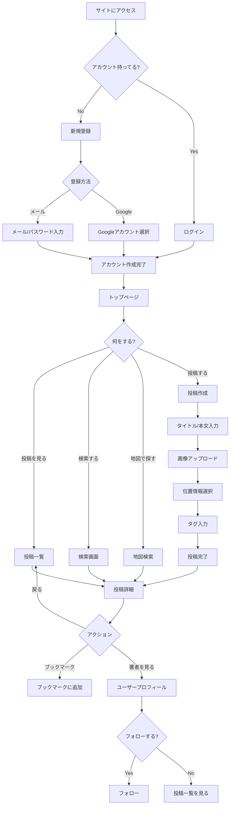
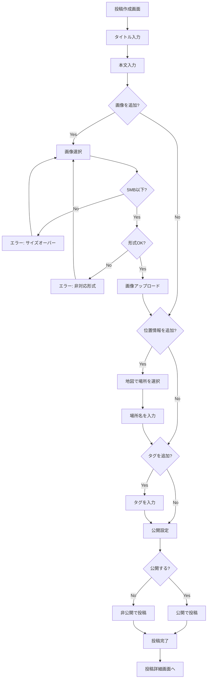
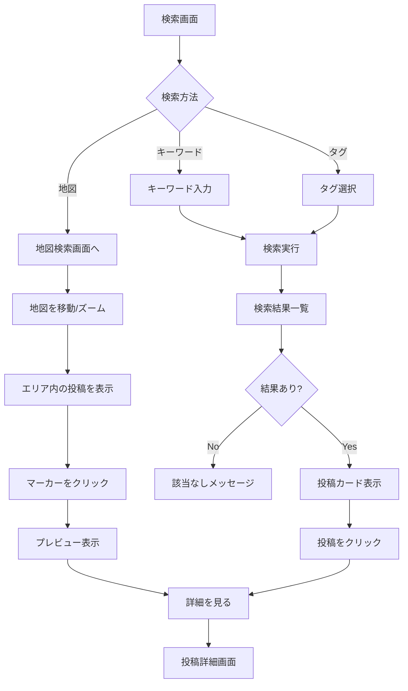
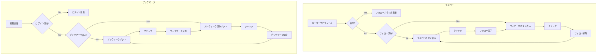
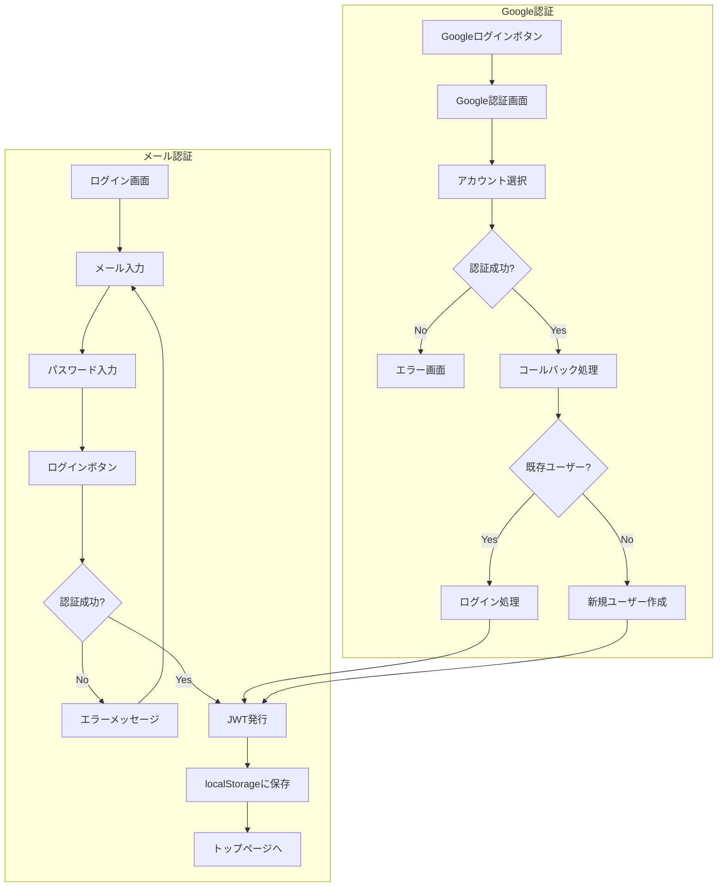

# ユーザーフロー図

## 1. 新規ユーザーの基本フロー

```mermaid
flowchart TD
    A[サイトにアクセス] --> B{アカウント持ってる?}
    B -->|No| C[新規登録]
    B -->|Yes| D[ログイン]

    C --> E{登録方法}
    E -->|メール| F[メール/パスワード入力]
    E -->|Google| G[Googleアカウント選択]

    F --> H[アカウント作成完了]
    G --> H
    D --> H

    H --> I[トップページ]
    I --> J{何をする?}

    J -->|投稿を見る| K[投稿一覧]
    J -->|検索する| L[検索画面]
    J -->|地図で探す| M[地図検索]
    J -->|投稿する| N[投稿作成]

    K --> O[投稿詳細]
    L --> O
    M --> O

    O --> P{アクション}
    P -->|ブックマーク| Q[ブックマークに追加]
    P -->|著者を見る| R[ユーザープロフィール]
    P -->|戻る| K

    R --> S{フォローする?}
    S -->|Yes| T[フォロー]
    S -->|No| U[投稿一覧を見る]

    N --> V[タイトル/本文入力]
    V --> W[画像アップロード]
    W --> X[位置情報選択]
    X --> Y[タグ入力]
    Y --> Z[投稿完了]
    Z --> O
```

---

## 2. 投稿作成フロー

```mermaid
flowchart TD
    A[投稿作成画面] --> B[タイトル入力]
    B --> C[本文入力]
    C --> D{画像を追加?}

    D -->|Yes| E[画像選択]
    E --> F{5MB以下?}
    F -->|No| G[エラー: サイズオーバー]
    G --> E
    F -->|Yes| H{形式OK?}
    H -->|No| I[エラー: 非対応形式]
    I --> E
    H -->|Yes| J[画像アップロード]

    D -->|No| K{位置情報を追加?}
    J --> K

    K -->|Yes| L[地図で場所を選択]
    L --> M[場所名を入力]
    K -->|No| N{タグを追加?}
    M --> N

    N -->|Yes| O[タグを入力]
    N -->|No| P[公開設定]
    O --> P

    P --> Q{公開する?}
    Q -->|Yes| R[公開で投稿]
    Q -->|No| S[非公開で投稿]

    R --> T[投稿完了]
    S --> T
    T --> U[投稿詳細画面へ]
```

---

## 3. 検索フロー

```mermaid
flowchart TD
    A[検索画面] --> B{検索方法}

    B -->|キーワード| C[キーワード入力]
    C --> D[検索実行]

    B -->|タグ| E[タグ選択]
    E --> D

    B -->|地図| F[地図検索画面へ]
    F --> G[地図を移動/ズーム]
    G --> H[エリア内の投稿を表示]
    H --> I[マーカーをクリック]
    I --> J[プレビュー表示]
    J --> K[詳細を見る]

    D --> L[検索結果一覧]
    L --> M{結果あり?}
    M -->|No| N[該当なしメッセージ]
    M -->|Yes| O[投稿カード表示]
    O --> P[投稿をクリック]
    P --> K

    K --> Q[投稿詳細画面]
```

---

## 4. フォロー/ブックマークフロー

```mermaid
flowchart TD
    subgraph フォロー
        A[ユーザープロフィール] --> B{自分?}
        B -->|Yes| C[フォローボタン非表示]
        B -->|No| D{フォロー済み?}
        D -->|No| E[フォローボタン表示]
        D -->|Yes| F[フォロー中ボタン表示]
        E --> G[クリック]
        G --> H[フォロー完了]
        H --> F
        F --> I[クリック]
        I --> J[フォロー解除]
        J --> E
    end

    subgraph ブックマーク
        K[投稿詳細] --> L{ログイン済み?}
        L -->|No| M[ログイン促進]
        L -->|Yes| N{ブックマーク済み?}
        N -->|No| O[ブックマークボタン]
        N -->|Yes| P[ブックマーク済みボタン]
        O --> Q[クリック]
        Q --> R[ブックマーク追加]
        R --> P
        P --> S[クリック]
        S --> T[ブックマーク解除]
        T --> O
    end
```

---

## 5. 認証フロー

```mermaid
flowchart TD
    subgraph メール認証
        A[ログイン画面] --> B[メール入力]
        B --> C[パスワード入力]
        C --> D[ログインボタン]
        D --> E{認証成功?}
        E -->|No| F[エラーメッセージ]
        F --> B
        E -->|Yes| G[JWT発行]
        G --> H[localStorageに保存]
        H --> I[トップページへ]
    end

    subgraph Google認証
        J[Googleログインボタン] --> K[Google認証画面]
        K --> L[アカウント選択]
        L --> M{認証成功?}
        M -->|No| N[エラー画面]
        M -->|Yes| O[コールバック処理]
        O --> P{既存ユーザー?}
        P -->|Yes| Q[ログイン処理]
        P -->|No| R[新規ユーザー作成]
        Q --> G
        R --> G
    end
```
